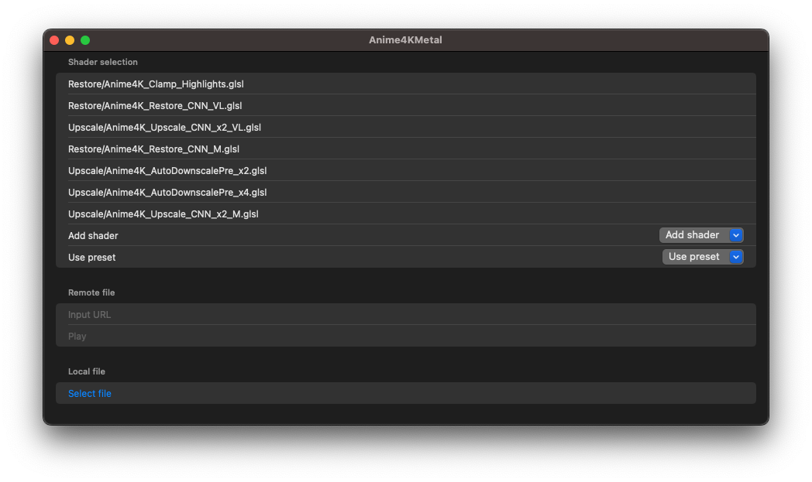
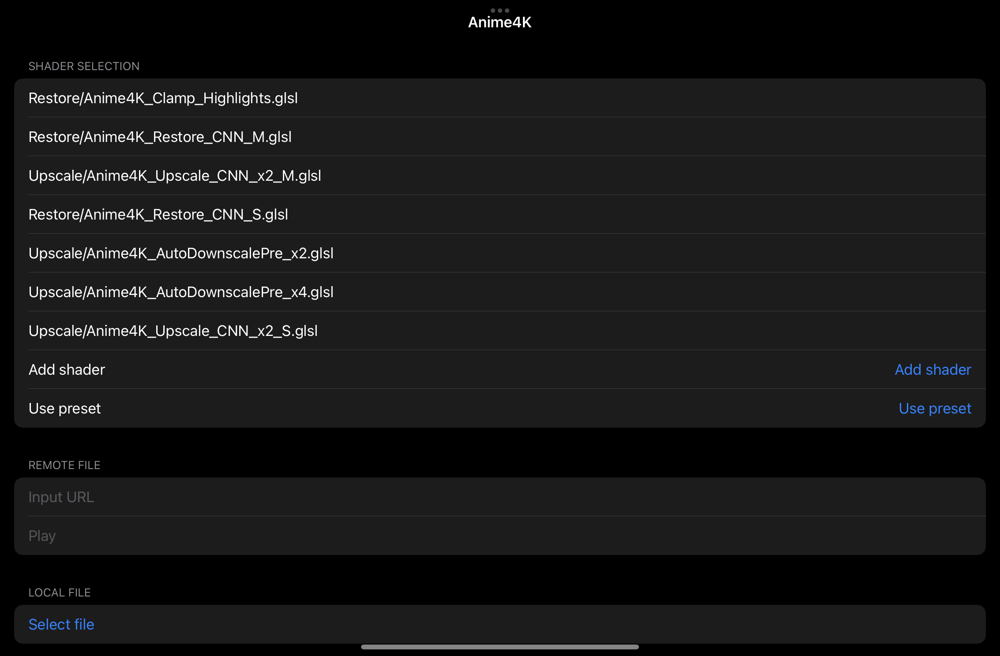
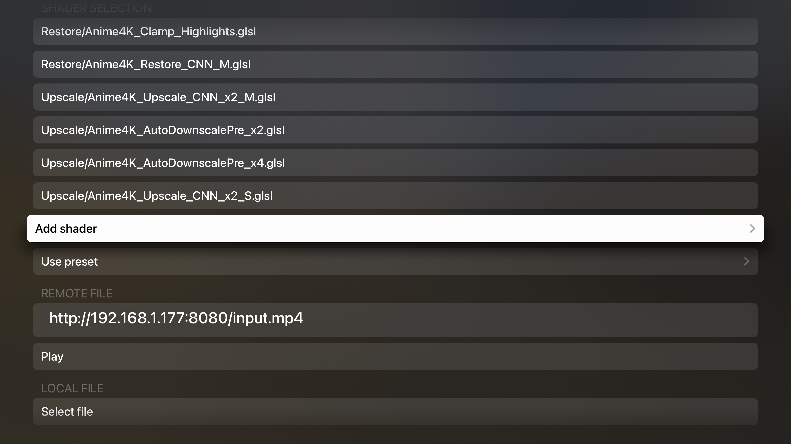
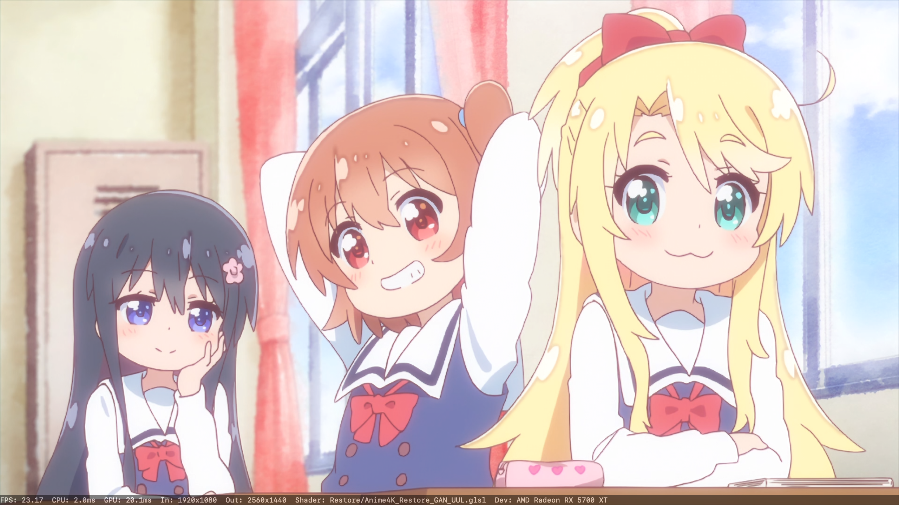
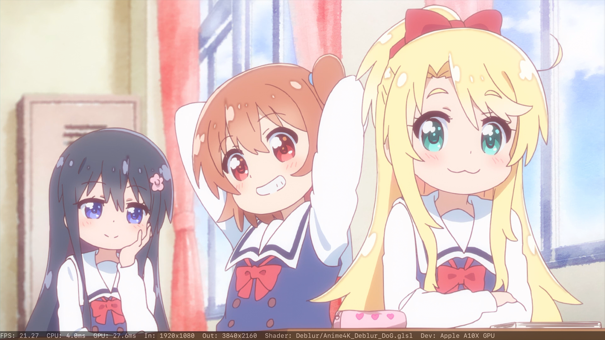
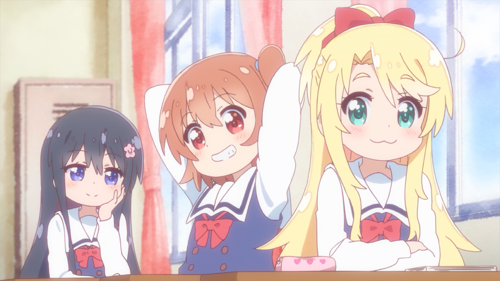
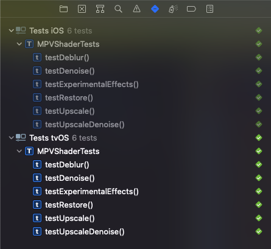

# Anime4KMetal

## Introduction

This is a port of [Anime4K](https://github.com/bloc97/Anime4K) to Metal. It dynamically translates GLSL shaders to Metal shaders and applies them in order during video playback. All shaders and presets from the Anime4K project should work regardless of performance.

## Requirements
- Xcode 13.0+
- iOS 15.0+
- macOS 12.0+ (via Mac Catalyst)
- tvOS 15.0+

## Pre-built binaries

Download in [Releases](https://github.com/imxieyi/Anime4KMetal/releases).

## Screenshots

### macOS



### iOS



### tvOS



### Preset demos

All presets are the same as defined the [official Anime4K instructions](https://github.com/bloc97/Anime4K/blob/master/md/GLSL_Instructions_Mac.md).

#### `Anime4K: Mode A+A (HQ)` on 48-core M1 Ultra


#### `Anime4K: Mode A+A (Fast)` on iPad mini (6th generation) (A15)


#### `Anime4K: Mode A (Fast)` on Apple TV 4K (A10X)


### Single shader demos (old version)
#### [Anime4K_Restore_CNN_M.glsl](https://github.com/bloc97/Anime4K/blob/master/glsl/Restore/Anime4K_Restore_CNN_M.glsl) on Apple M1


#### [Anime4K_Restore_GAN_UUL.glsl](https://github.com/bloc97/Anime4K/blob/master/glsl/Restore/Anime4K_Restore_GAN_UUL.glsl) on 5700XT



#### [Anime4K_Deblur_DoG.glsl](https://github.com/bloc97/Anime4K/blob/master/glsl/Deblur/Anime4K_Deblur_DoG.glsl) on Apple TV 4K (A10X)



### Original image



*Note: The above footages are only for demo purpose.

## How to use

Only mp4 files with yuv420 pixel format are supported by the OS built-in decoder. Other formats must be converted to the supported format.

### Pick shader or preset

Pick the desired shader or preset under `Shader selection` section. Not all shaders and presets will run well on all devices. If you see obvious dropped frames please use a smaller shader or preset instead. Large shaders and presets will take longer time to convert and compile. In the meantime the app will appear not responsive.

### Play from URL

On tvOS no local file can be accessed. You can start a HTTP server (for example nginx) on macOS and play from URL on tvOS.

Click the cell `Input URL`. Input URL (`http://xxx`). Then click `done` and `Play`. The video should start playing

### Play from file

On iOS and macOS you can simply click `Select file` and pick a local file to play.

## Building

1. Clone this project:
```bash
git clone https://github.com/imxieyi/Anime4KMetal.git
cd Anime4KMetal
git submodule update --init
```
2. Open `Anime4KMetal.xcodeproj`.
3. Select target and build. For macOS please use `Anime4KMetal (iOS)`.

## Test shader converter

To test the shader converter simply launch the XCTest suite on a target device.



There are a ton of shader warnings due to unused variables. These messages can be ignored.

## Known issues

- Due to how bilinear sampler works in Metal the output image is not subpixel aligned with the original image.
- The resulting image is different from mpv, also due to the sampler issue.

## License

This project is licensed under Apache 2.0 license.

## Credits

- GLSL shaders are from [Anime4K](https://github.com/bloc97/Anime4K)
- Shader converter referenced code from [mpv](https://github.com/mpv-player/mpv)
