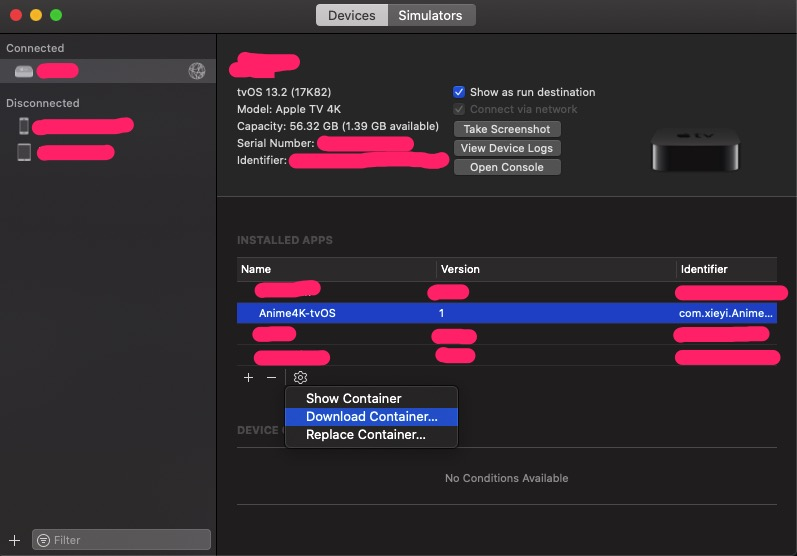

#  Anime4K for tvOS

## Introduction
This is a port of GLSL [Anime4K](https://github.com/bloc97/Anime4K) to tvOS (Metal).

## Requirements
- Apple TV 4K
- Xcode 11.0+
- tvOS 13.0+

## Performance
On [Apple TV 4K](https://en.wikipedia.org/wiki/Apple_TV#5th_generation_(4K)) (A10X), each frame takes about 30ms to render when scaling 1080p to 4K. (Using [Anime4K_Adaptive_v1.0RC2](https://github.com/bloc97/Anime4K/blob/master/glsl/Anime4K_Adaptive_v1.0RC2.glsl) shader) Most animes are 24 fps, which can be rendered in real time.

## Screenshot

*Note: The above footage is only for demo purpose.

## How to use

### Option 1: Play from URL

Click the cell under `Input URL`. Input URL (`http://xxx`). Then click `done`. The video should be played automatically.

### Option 2: Play from local file

Currently it can only play mp4 files in `Caches` directory.

To transfer video files for playing, you should follow the following steps:

1. Connect your Apple TV 4K to Xcode via network.
2. Compile and run this project.
3. Download container from **Devices and Simulators**.

4. Open the `.xcappdata` package exported.
5. Put video files into `AppData/Library/Caches`.  **Don't put under `Documents`. Even if you can do this, this directory is not accessible on tvOS.**
6. Replace container using the last option in the screenshot above.
7. Launch app and select the video you want to play using remote.
