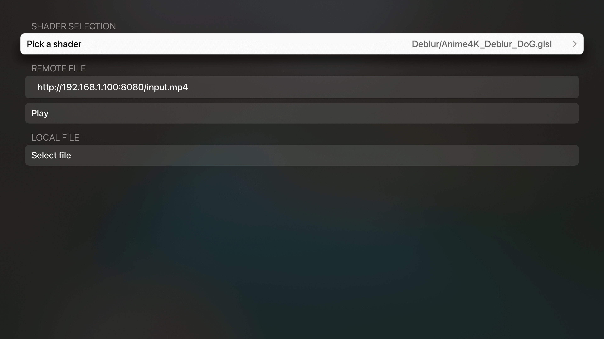

# Anime4KMetal

## Introduction

This is a port of [Anime4K](https://github.com/bloc97/Anime4K) to Metal. It dynamically translates GLSL shaders to Metal shaders and applies them during video playback. All shaders from the Anime4K project should work regardless of performance.

## Requirements
- Xcode 13.0+
- iOS 15.0+
- macOS 12.0+ (via Mac Catalyst)
- tvOS 15.0+

## Pre-built binaries

Download in [Releases](https://github.com/imxieyi/Anime4KMetal/releases).

## Screenshots

### macOS


### tvOS



### [Anime4K_Restore_CNN_M.glsl](https://github.com/bloc97/Anime4K/blob/master/glsl/Restore/Anime4K_Restore_CNN_M.glsl) on M1 Mac


### [Anime4K_Restore_GAN_UUL.glsl](https://github.com/bloc97/Anime4K/blob/master/glsl/Restore/Anime4K_Restore_GAN_UUL.glsl) on 5700XT


### [Anime4K_Deblur_DoG.glsl](https://github.com/bloc97/Anime4K/blob/master/glsl/Deblur/Anime4K_Deblur_DoG.glsl) on Apple TV 4K (A10X)


### Original image


*Note: The above footages are only for demo purpose.

## How to use

Only mp4 files with yuv420 pixel format are supported by the built-in decoder. Other formats must be converted to the supported format.

### Pick shader

Pick the desired shader under `Shader selection` section. Not all shaders will run well on all devices. If you see obvious dropped frames please use a smaller shader instead. Large shaders will take longer time to convert and compile. In the meantime the app will appear not responsive.

On macOS it's recommended putting the app in fullscreen mode for the best experience.

### Play from URL

On tvOS no local file can be accessed. You can start a HTTP server (for example nginx) on macOS and play from URL on tvOS.

Click the cell `Input URL`. Input URL (`http://xxx`). Then click `done` and `Play`. The video should start playing

### Play from file

On iOS and macOS you can simply click `Select file` and pick a local file to play.

## Building

1. Clone this project:
```bash
git clone https://github.com/imxieyi/Anime4KMetal.git
cd Anime4KMetal
git submodule update --init
```
2. Open `Anime4KMetal.xcodeproj`.
3. Select target and build.

## Test shader converter

To test the shader converter simply launch the XCTest suite on a target device.


There are a ton of shader warnings due to unused variables. These messages can be ignored.

## Known issues

Due to how bilinear sampler works the output image is not subpixel aligned with the original image.

## License

This project is licensed under Apache 2.0 license.

## Credits

- GLSL shaders are from [Anime4K](https://github.com/bloc97/Anime4K)
- Shader converter referenced code from [mpv](https://github.com/mpv-player/mpv)
